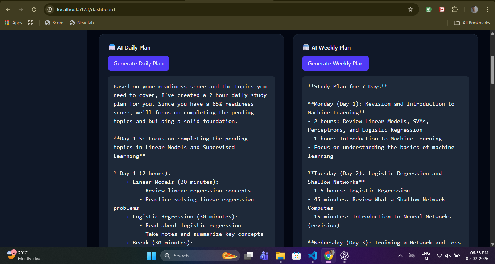

# 📘 AI Study Planner

    AI Study Planner is a smart web application that helps students organize, track, and optimize their exam preparation using artificial intelligence. Users can upload syllabus PDFs or images, automatically extract topics, monitor progress, generate personalized study plans, and track exam readiness — all in one place.

## 🚀 Features

    📂 Syllabus Upload
        Upload syllabus as PDF or image and extract topics automatically using AI.

    📊 Topic-wise Progress Tracking
        Mark topics as completed and visualize progress using interactive charts.

    🎯 Exam Readiness Prediction
        AI analyzes completion, consistency, and recency to estimate exam readiness.

    🧠 AI Analysis
        Get AI-generated insights on weak areas and preparation strategy.

    📅 AI Daily & Weekly Study Plans
        Personalized study plans generated based on your syllabus and progress.

    🔥 Real Study Streak
        Tracks actual learning activity (topic completion or AI plan usage).

    🔐 Authentication Ready
        Secure user-based experience with authentication support.

    🌙 Modern Dark UI
        Clean, responsive, and student-friendly interface.

## 🛠️ Tech Stack

### Frontend

    React (Vite)

    Tailwind CSS

    Chart.js

    React Router

### Backend

    Node.js

    Express.js

    Multer (file uploads)

    AI APIs (Groq / OpenAI compatible)

    Storage

    LocalStorage (current)

    MongoDB ready (future expansion)

## 📸 Screenshots

### 🏠 Landing Page

### 📊 Dashboard

### 📂 Upload Syllabus

### 🧠 AI Analysis

### 📅 AI Study Plans

## 📂 Project Structure
    ai-study-planner/
    │
    ├── client/
    │   ├── src/
    │   │   ├── components/
    │   │   ├── pages/
    │   │   ├── context/
    │   │   └── App.jsx
    │
    ├── server/
    │   ├── routes/
    │   ├── index.js
    │   └── .env
    │
    ├── screenshots/
    │   ├── landing.png
    │   ├── dashboard.png
    │   ├── upload.png
    │   ├── ai-analysis.png
    │   └── study-plans.png
    │
    └── README.md

## ⚙️ Installation & Setup
    1️⃣ Clone Repository
        git clone https://github.com/your-username/ai-study-planner.git
        cd ai-study-planner

    2️⃣ Frontend Setup
        cd client
        npm install
        npm run dev

    3️⃣ Backend Setup
        cd server
        npm install
        node index.js

    Create a .env file inside server/:

        PORT=5000
        GROQ_API_KEY=your_groq_api_key_here

## 🧪 How It Works

    User uploads syllabus (PDF/Image)
    AI extracts topics automatically
    Topics are stored and tracked
    Progress updates exam readiness score
    AI generates daily & weekly study plans
    Study streak updates based on real activity

# 🧠 Future Enhancements

    MongoDB persistence
    Full authentication (JWT / OAuth)
    Push notifications & reminders
    Calendar integration
    Performance analytics dashboard

## 🤝 Contribution

    Contributions are welcome!
    Feel free to fork the repo and submit pull requests.

## 📜 License

    This project is licensed under the MIT License.

### ⭐ If you like this project

    Give it a ⭐ on GitHub — it really helps!